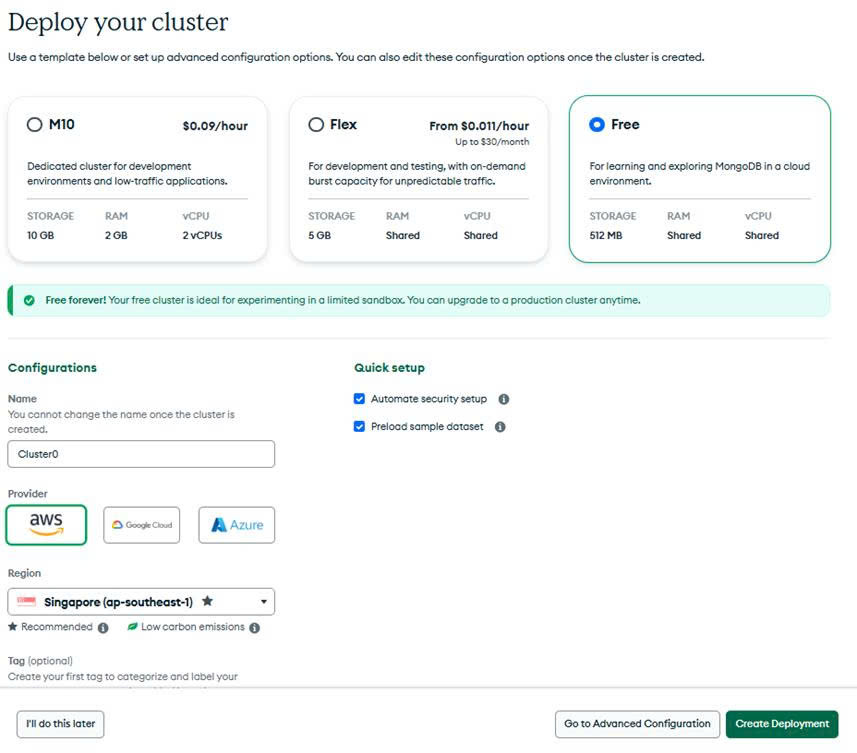
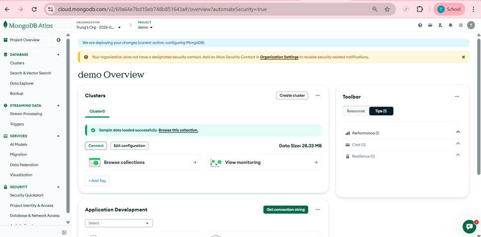
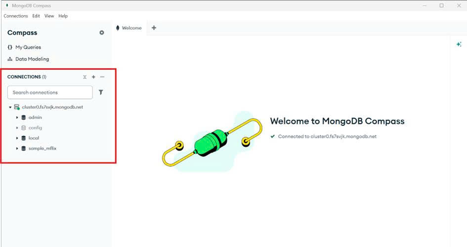
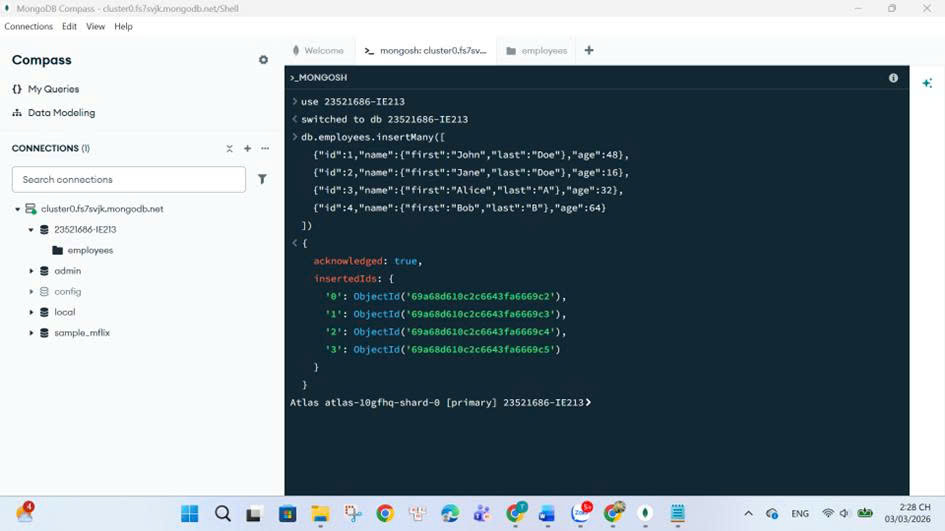
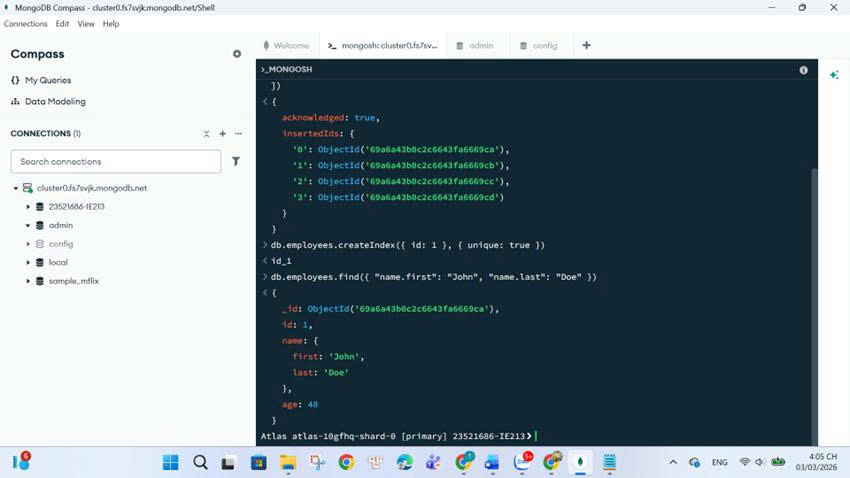
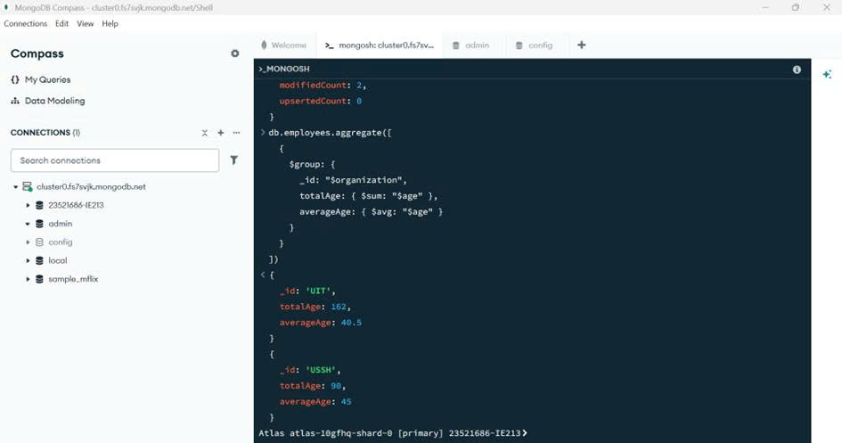

# Lab 01 – MongoDB CRUD Operation

## 1. Mục tiêu

- Làm quen với MongoDB Atlas trên nền tảng cloud
- Kết nối cơ sở dữ liệu bằng MongoDB Compass
- Thực hiện các thao tác CRUD trong MongoDB
- Làm việc với embedded document
- Sử dụng MongoDB Query Operators ($gt, $lt, $exists, $in)
- Sử dụng Aggregation Pipeline

---

## 2. Thông tin sinh viên

- **Họ tên:** Phú Nữ Quốc Trung
- **MSSV:** 23521686
- **Lớp:** IE213.Q21
- **Môn học:** IE213 – Kỹ thuật phát triển hệ thống Web

---

## 3. Công cụ và môi trường sử dụng

- **MongoDB Atlas** – Cloud database
- **MongoDB Compass** – GUI quản lý MongoDB
- **MongoDB Shell (mongosh)** – MongoDB command line
- **GitHub** – Lưu trữ bài thực hành
- **Hệ điều hành:** Windows 11

---

## 4. Nội dung thực hiện

### 4.1 Thiết lập môi trường

- Đăng ký tài khoản MongoDB Atlas
- Tạo Cluster miễn phí (Shared Cluster) tại khu vực Singapore
- Nạp dữ liệu mẫu vào cluster
- Cài đặt MongoDB Compass v1.49.2
- Kết nối MongoDB Compass với Atlas

### 4.2 Tạo database và collection

- Tạo database: `23521686-IE213`
- Tạo collection: `employees`
- Thêm 4 document đầu tiên

### 4.3 Thao tác dữ liệu (CRUD)

- Tạo unique index cho trường `id`
- Tìm document theo điều kiện (name, age)
- Thêm document có middle name
- Cập nhật dữ liệu (xóa field, thêm field, sửa field)
- Sử dụng Aggregation để thống kê theo organization

---

## 5. Cách chạy

1. Mở MongoDB Compass
2. Kết nối đến cluster MongoDB Atlas
3. Chuyển sang database `23521686-IE213`
4. Copy từng lệnh từ file `commands.txt` vào tab Query
5. Chạy lần lượt từng lệnh để xem kết quả

---

## 6. Chi tiết các bước thực hiện

### Bước 1: Tạo Database
```javascript
use 23521686-IE213
```

### Bước 2: Thêm dữ liệu
```javascript
db.employees.insertMany([
  { "id": 1, "name": { "first": "John", "last": "Doe" }, "age": 48 },
  { "id": 2, "name": { "first": "Jane", "last": "Doe" }, "age": 16 },
  { "id": 3, "name": { "first": "Alice", "last": "A" }, "age": 32 },
  { "id": 4, "name": { "first": "Bob", "last": "B" }, "age": 64 }
])
```

### Bước 3-10: Xem chi tiết trong file `commands.txt`

Tất cả 10 bước thực hiện chi tiết được lưu trong file [commands.txt](commands.txt)

---

## 7. Hình ảnh minh họa

- Đăng ký MongoDB Atlas – 
- Khởi tạo Cluster – 
- Nạp dữ liệu mẫu – 
- Kết nối Compass – 
- InsertMany data – 
- Find John Doe – 
- Aggregation result – 

---

## 8. Kết quả đạt được

- Kết nối MongoDB Atlas thành công
- Tạo database và collection thành công
- Thực hiện CRUD operations đầy đủ
- Sử dụng Aggregation Pipeline thành công
- Tính tổng tuổi và tuổi trung bình theo organization

---

## 9. Ghi chú sử dụng AI

- **Công cụ:** GitHub Copilot, ChatGPT
- **Mục đích:** Hỗ trợ tổ chức cấu trúc README, kiểm tra cú pháp lệnh MongoDB
- **Phạm vi:** Cấu trúc README, hướng dẫn kỹ thuật (tất cả thao tác MongoDB thực hiện thủ công)
