# Lab02 - Movie Reviews Backend API

## 1. Mục tiêu

- Xây dựng backend cho project Movie Reviews bằng Node.js + Express.
- Kết nối đến cơ sở dữ liệu MongoDB Atlas với driver `mongodb`.
- Tổ chức code theo mô hình tách lớp: Route - Controller - DAO.
- Triển khai API lấy danh sách phim và hỗ trợ lọc theo `rated` hoặc `title`.
- Làm quen với quản lý biến môi trường bằng file `.env`.

## 2. Thông tin sinh viên

- Họ tên: Phú Nữ Quốc Trung
- MSSV: 23521686
- Lớp: IE213.Q21
- Môn học: IE213.Q21 - Kỹ thuật phát triển hệ thống Web

## 3. Công cụ và môi trường sử dụng

- **Node.js**: Runtime chạy backend.
- **Express.js**: Framework xây dựng REST API.
- **MongoDB Atlas**: Cơ sở dữ liệu cloud.
- **MongoDB Node.js Driver**: Kết nối và thao tác dữ liệu MongoDB.
- **Dotenv**: Quản lý biến môi trường.
- **CORS**: Cho phép gọi API từ frontend/client.
- **Nodemon**: Hỗ trợ chạy server trong quá trình phát triển.
- **Postman/Browser**: Kiểm thử API endpoint.

## 4. Nội dung thực hiện

### Cấu trúc thư mục

```
Lab02/
├── README.md
├── screenshots/
└── movie-reviews/
    └── backend/
        ├── package.json           # Khai báo project, scripts, dependencies
        ├── .env                   # Biến môi trường (PORT, DB URI, namespace)
        ├── index.js               # Điểm khởi chạy server và kết nối MongoDB
        ├── server.js              # Cấu hình Express app, middleware, route
        ├── api/
        │   ├── movies.route.js    # Định nghĩa endpoint
        │   └── movies.controller.js  # Xử lý request/response
        └── dao/
            └── moviesDAO.js       # Tầng truy cập dữ liệu MongoDB
```

### 4.1 Khởi tạo project backend

1. Tạo cấu trúc thư mục `movie-reviews/backend`
2. Khởi tạo `package.json` và cài các dependencies cần thiết

### 4.2 Cấu hình môi trường

Tạo file `.env` với các biến:
- `PORT=8000`
- `MOVIEREVIEWS_DB_URI=<mongodb_atlas_uri>`
- `MOVIEREVIEWS_NS=sample_mflix`

### 4.3 Tạo Express server (server.js)

- Cấu hình middleware `cors`, `express.json`
- Khai báo route chính `/api/v1/movies`
- Xử lý route không tồn tại với mã lỗi 404

### 4.4 Kết nối MongoDB Atlas (index.js)

- Đọc biến môi trường bằng `dotenv`
- Kết nối MongoDB bằng `MongoClient`
- Inject collection handle qua `MoviesDAO.injectDB(client)`
- Khởi chạy server theo `PORT`

### 4.5 Xây dựng DAO (dao/moviesDAO.js)

- Truy cập collection `movies` trong database `sample_mflix`
- Truy vấn danh sách phim có phân trang
- Hỗ trợ filter theo `title` (text search) và `rated`

### 4.6 Xây dựng Controller và Route

- **movies.controller.js**: Nhận query params `page`, `moviesPerPage`, `rated`, `title` và trả JSON response
- **movies.route.js**: Map endpoint `GET /api/v1/movies`

## 5. Cách chạy

1. Chuẩn bị MongoDB Atlas: tạo cluster, load dataset `sample_mflix`, lấy connection string
2. Cài dependencies: `npm install` (trong thư mục backend)
3. Cấu hình `.env`: điền `MOVIEREVIEWS_DB_URI` và `PORT=8000`
4. Chạy server: `npm run dev`
5. Kiểm thử API: truy cập `http://localhost:8000/api/v1/movies` trên browser

## 6. Kết quả

Backend API hoạt động thành công trên `http://localhost:8000`

- **GET /api/v1/movies**: Trả 20 phim, total: 21,349
- **GET /api/v1/movies?rated=PG**: Lọc rated thành công
- **GET /api/v1/movies?title=blacksmith**: Tìm kiếm title thành công
- **GET /api/v1/movies?page=0&moviesPerPage=10**: Phân trang thành công

## 7. Chi tiết kỹ thuật

Kiến trúc 3-layer: Route → Controller → DAO
- Endpoint: `GET /api/v1/movies`
- Filter: `rated` (exact match), `title` (text search)
- Pagination: `page`, `moviesPerPage`
- Response: JSON with `movies[]`, `page`, `entries_per_page`, `total_results`

## 8. Hình ảnh minh họa

### Phiên bản Node.js
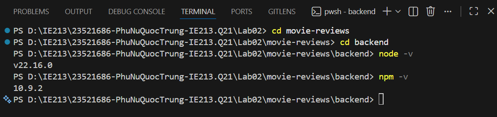

### Khởi tạo npm project
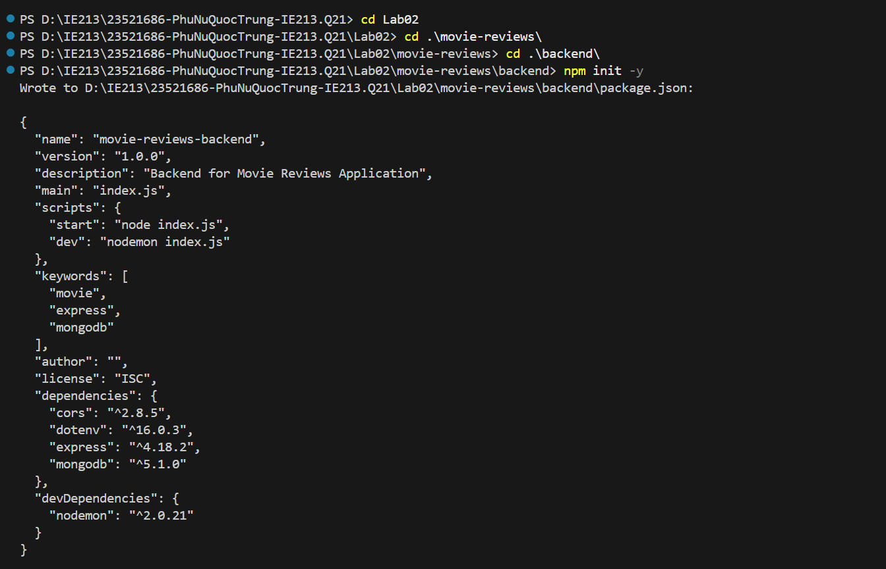

### Cài dependencies
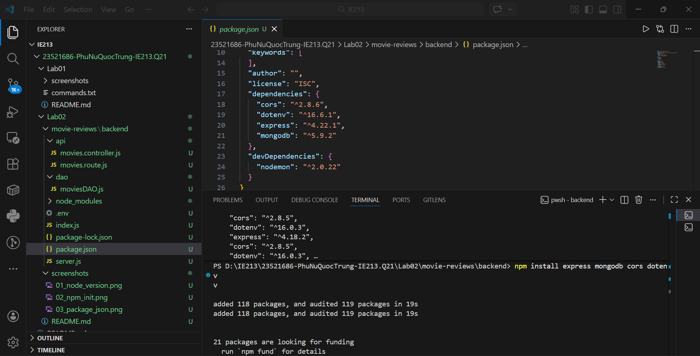

### Cài nodemon
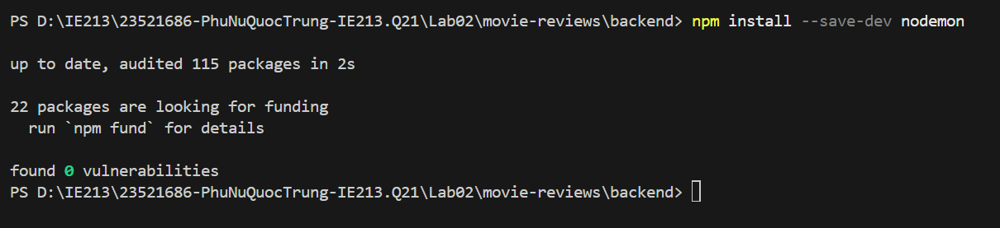

### Cấu hình package.json
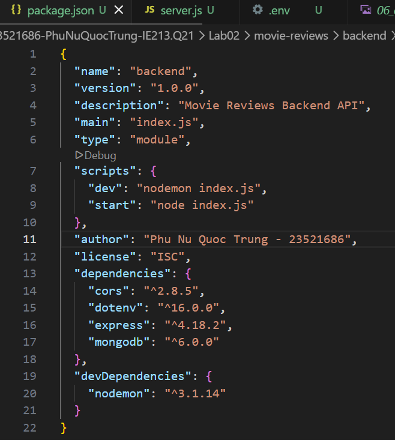

### Cấu trúc thư mục
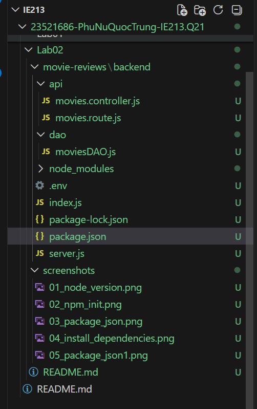

### Tạo file .env
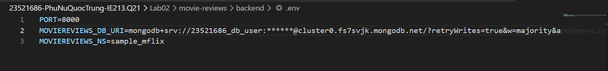

### Cấu hình server.js
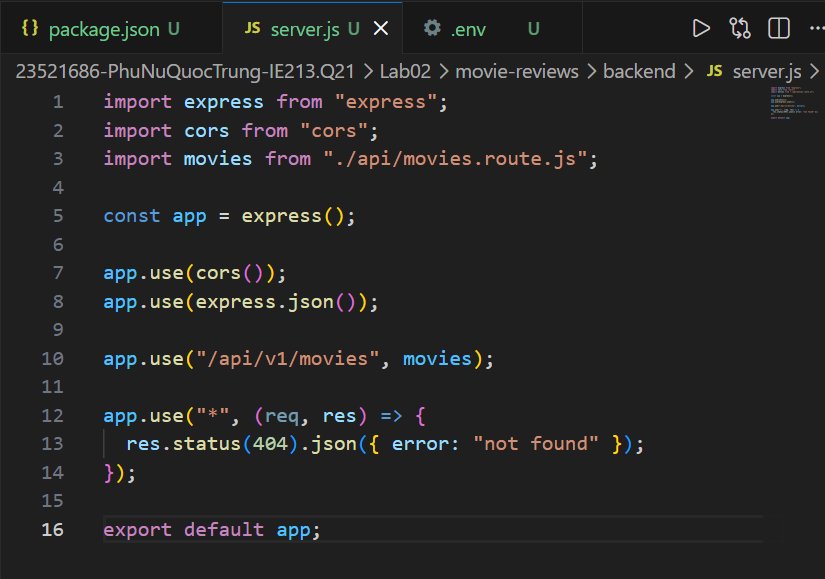

### Chạy server
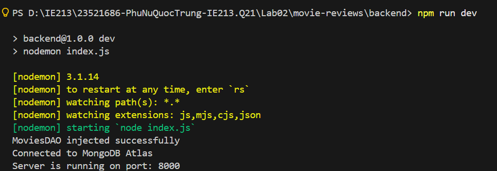

### Cấu hình index.js
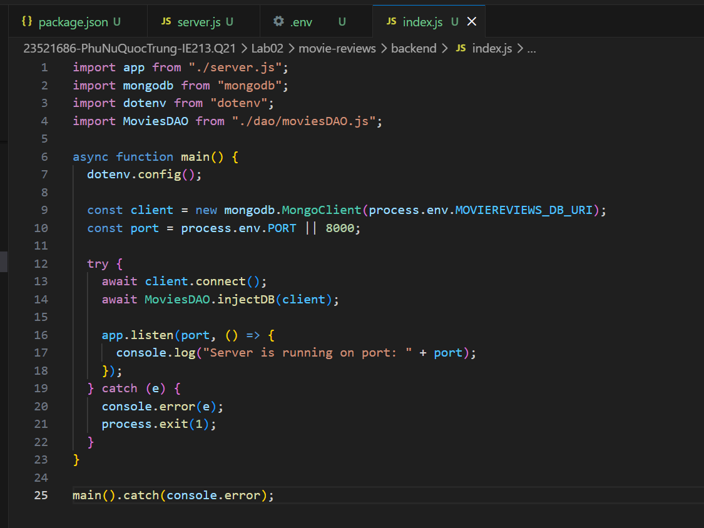

### Định tuyến movies.route.js
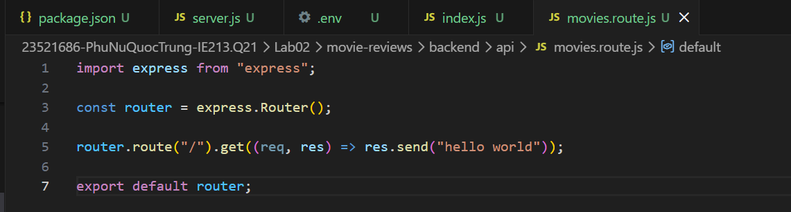

### API trả danh sách phim
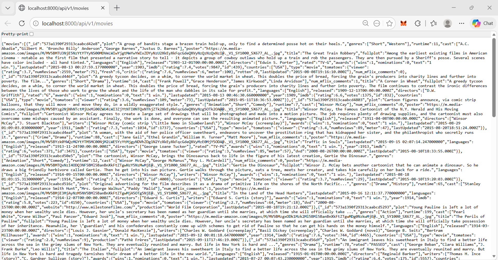

### Filter theo title
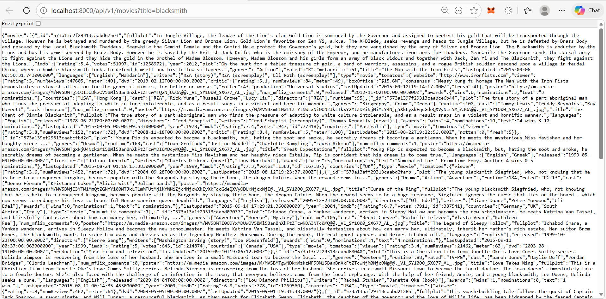

## 9. Đánh giá

Hoàn thành:
- Backend Movie Reviews API với Express.js
- Kiến trúc Route-Controller-DAO
- MongoDB Atlas integration
- API endpoints với filter, search, pagination
- 13 hình ảnh minh họa

Chưa hoàn thành: Không

## 10. Ghi chú sử dụng AI

- **Công cụ sử dụng:** ChatGPT, GitHub Copilot.
- **Mục đích sử dụng:** Hỗ trợ gợi ý cấu trúc project backend, chuẩn hóa README, rà soát cú pháp Node.js/Express.
- **Phạm vi:** Cấu trúc README, hướng dẫn kỹ thuật - toàn bộ thao tác cài đặt, viết code và kiểm thử được thực hiện thủ công bởi sinh viên.


